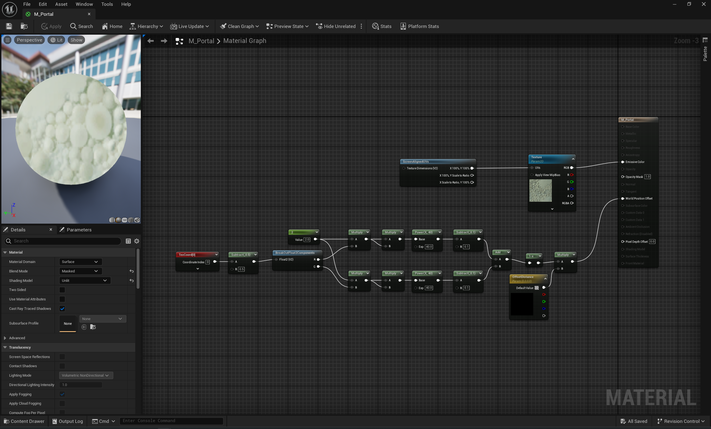

# Portals in Unreal Engine 5

This project is an experimental implementation of portals in Unreal Engine 5.4, designed to explore rendering and gameplay mechanics involving seamless teleportation. The core functionality is encapsulated in the [PortalComponent](./Source/TechPortals/PortalComponent.h), which manages portal behavior, rendering, and player interactions.

https://github.com/user-attachments/assets/63c50498-b929-4b17-805f-261513ef0e61

## Portal Material

